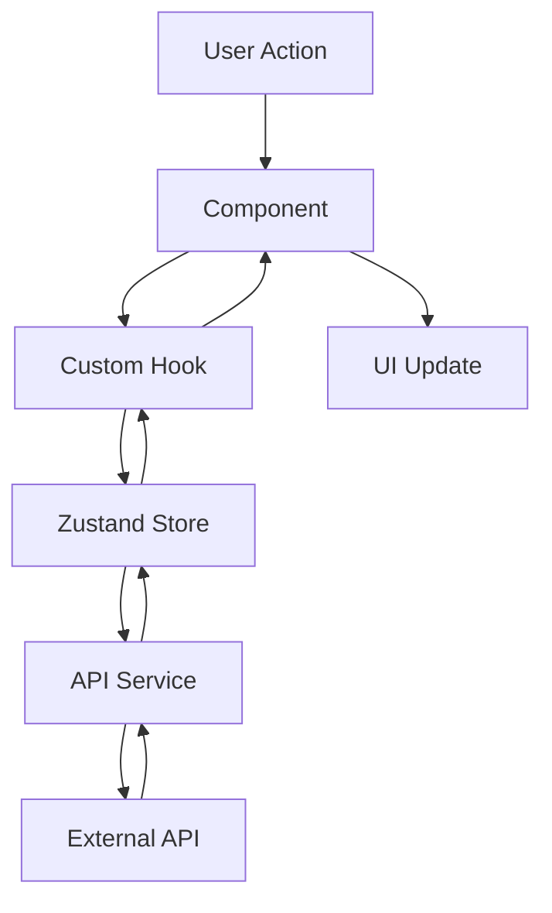

# StockPulse Architecture Guide

This document outlines the architectural decisions, patterns, and structure of the StockPulse
application.

## 🏗️ Overall Architecture

StockPulse follows a modern, enterprise-grade architecture built on Next.js 15 + React 19 with the
following principles:

- **Next.js 15 App Router** - Latest framework with React Compiler optimizations
- **Enterprise TypeScript** - Comprehensive utility types for consistency and safety
- **Vercel-Native** - Built specifically for Vercel's edge infrastructure
- **Type-First Development** - Utility types and runtime validation throughout
- **Performance Optimized** - React Compiler, edge functions, and Core Web Vitals focus
- **Developer Experience** - Claude Code prompts and Cursor IDE integration
- **Security-First** - Environment variable auditing and proper secret management

## 📁 Directory Structure

```
stock-pulse/
├── app/                           # Next.js 15 App Router
│   ├── api/                      # API routes with TypeScript utilities
│   │   ├── health/              # Health monitoring endpoint
│   │   └── cron/                # Vercel cron jobs
│   ├── layout.tsx               # Root layout with React 19
│   ├── page.tsx                 # Home page component
│   ├── loading.tsx              # Global loading states
│   ├── error.tsx                # Global error boundaries
│   └── globals.css              # Global Tailwind styles
├── src/                         # Enterprise source structure
│   ├── core/                    # Core application modules
│   │   ├── types/               # TypeScript type definitions
│   │   │   ├── index.ts         # Central type exports
│   │   │   ├── utils.ts         # Utility types
│   │   │   └── stock.ts         # Stock-specific types
│   │   ├── constants/           # Application constants
│   │   └── utils/               # Core utility functions
│   ├── features/                # Feature-based modules
│   │   ├── stocks/              # Stock tracking feature
│   │   │   ├── components/      # Stock-related components
│   │   │   ├── services/        # Stock API services
│   │   │   ├── stores/          # Stock state management
│   │   │   └── hooks/           # Stock-specific hooks
│   │   ├── notifications/       # Notification feature
│   │   │   ├── components/      # Notification components
│   │   │   ├── services/        # Notification services
│   │   │   └── stores/          # Notification state
│   │   └── pwa/                # PWA functionality
│   └── shared/                  # Shared modules
│       ├── components/          # Shared components
│       │   └── ui/              # Base UI components
│       ├── hooks/               # Shared custom hooks
│       └── utils/               # Shared utility functions
├── docs/                        # Comprehensive documentation
├── claude.rules/               # Claude Code development prompts
├── vercel.json                 # Vercel deployment configuration
└── tests/                      # Test files and configurations
```

## 🔄 Data Flow

### 1. Client-Side Data Flow



### 2. State Management

StockPulse uses **Zustand** for state management with the following stores:

- **App Store** - Global UI state, loading states, notifications
- **Portfolio Store** - User's portfolio data and calculations
- **User Store** - Authentication, preferences, settings
- **Market Store** - Stock quotes, market data, news

### 3. API Layer

```typescript
// API Service Pattern
export class StockService {
  private static instance: StockService;
  private apiClient: ApiClient;

  static getInstance(): StockService {
    if (!StockService.instance) {
      StockService.instance = new StockService();
    }
    return StockService.instance;
  }

  async getQuote(symbol: string): Promise<StockQuote> {
    // Implementation
  }
}
```

## 🎨 Component Architecture

### Design System Hierarchy

```
Components
├── Base Components (Button, Input, Card)
├── Composite Components (DataTable, Modal, Chart)
├── Feature Components (StockCard, PortfolioSummary)
└── Page Components (HomePage, PortfolioPage)
```

### Component Guidelines

1. **Single Responsibility** - Each component has one clear purpose
2. **Composition over Inheritance** - Build complex UIs by composing simpler components
3. **Props Interface** - All props are typed with TypeScript interfaces
4. **Documentation** - JSDoc comments for all public props and functions
5. **Testing** - Each component has corresponding test files

### Example Component Structure

```typescript
import React from 'react';

/**
 * Props for the StockCard component
 */
export interface StockCardProps {
  /** Stock symbol (e.g., "AAPL") */
  symbol: string;
  /** Current stock price */
  price: number;
  /** Price change amount */
  change: number;
  /** Price change percentage */
  changePercent: number;
  /** Click handler for the card */
  onClick?: (symbol: string) => void;
}

/**
 * Displays stock information in a card format
 *
 * @param props - The component props
 * @returns JSX element
 */
export const StockCard: React.FC<StockCardProps> = ({
  symbol,
  price,
  change,
  changePercent,
  onClick,
}) => {
  // Component implementation
};
```

## 🔌 API Integration

### External APIs

1. **Finnhub API** - Real-time stock quotes, company profiles, historical data
2. **News API** - Financial news and market updates

### API Client Pattern

```typescript
class ApiClient {
  private baseURL: string;
  private timeout: number;
  private retryAttempts: number;

  constructor(config: ApiConfig) {
    this.baseURL = config.baseURL;
    this.timeout = config.timeout;
    this.retryAttempts = config.retryAttempts;
  }

  async request<T>(endpoint: string, options?: RequestOptions): Promise<T> {
    // Retry logic, error handling, request/response interceptors
  }
}
```

### Caching Strategy

- **React Query** - Server state caching and synchronization
- **Browser Cache** - Static assets and API responses
- **Local Storage** - User preferences and offline data
- **Service Worker** - Offline page caching

## 📱 Progressive Web App

### PWA Features

1. **Service Worker** - Offline functionality and background sync
2. **Web App Manifest** - App-like installation and appearance
3. **Push Notifications** - Real-time price alerts
4. **Offline Fallback** - Graceful degradation when offline

### Caching Strategies

```typescript
// Cache First - for static assets
const CACHE_FIRST = ['/', '/manifest.json', '/icons/*'];

// Network First - for API data
const NETWORK_FIRST = ['/api/*'];

// Stale While Revalidate - for frequently updated content
const SWR = ['/news/*', '/quotes/*'];
```

## 🔒 Security Architecture

### Client-Side Security

1. **Input Validation** - All user inputs validated with Zod schemas
2. **XSS Prevention** - React's built-in protection + CSP headers
3. **API Key Management** - Environment variables only
4. **HTTPS Enforcement** - Secure connections required

### API Security

1. **Rate Limiting** - Prevent API abuse
2. **CORS Configuration** - Restricted origins
3. **Request Validation** - Schema validation for all requests
4. **Error Handling** - No sensitive information in error messages

## 🎯 Performance Optimization

### Next.js Optimizations

1. **App Router** - Latest Next.js routing with layouts
2. **Image Optimization** - Automatic image optimization
3. **Code Splitting** - Automatic route-based splitting
4. **Bundle Analysis** - Regular bundle size monitoring

### Runtime Optimizations

1. **React.memo** - Component memoization for expensive renders
2. **useMemo/useCallback** - Hook optimizations
3. **Virtual Scrolling** - For large lists (portfolio, watchlist)
4. **Debounced Inputs** - Prevent excessive API calls

### Loading Strategies

```typescript
// Lazy loading for non-critical components
const ChartComponent = lazy(() => import('./ChartComponent'));

// Preloading for critical routes
const router = useRouter();
useEffect(() => {
  router.prefetch('/portfolio');
}, []);
```

## 🧪 Testing Architecture

### Testing Strategy

1. **Unit Tests** - Individual component and function testing
2. **Integration Tests** - Component interaction testing
3. **E2E Tests** - Full user workflow testing
4. **Visual Regression** - UI consistency testing

### Test Structure

```
tests/
├── __mocks__/           # Mock data and services
├── utils/               # Test utilities and helpers
├── setup.ts            # Test environment setup
└── e2e/                # Playwright E2E tests
```

### Testing Guidelines

1. **Test Behavior, Not Implementation** - Focus on user interactions
2. **Mock External Dependencies** - Isolate units under test
3. **Accessibility Testing** - Ensure components are accessible
4. **Performance Testing** - Monitor render times and memory usage

## 🚀 Deployment Architecture

### Build Process

1. **Type Checking** - TypeScript compilation
2. **Linting** - ESLint code quality checks
3. **Testing** - Unit and E2E test execution
4. **Building** - Next.js production build
5. **Analysis** - Bundle size and performance analysis

### CI/CD Pipeline

```yaml
# GitHub Actions workflow
- Checkout code
- Setup Node.js and pnpm
- Install dependencies
- Run linting and type checking
- Run tests with coverage
- Build application
- Deploy to staging/production
```

### Environment Configuration

- **Development** - Local development with hot reload
- **Staging** - Production-like environment for testing
- **Production** - Optimized build with monitoring

## 📊 Monitoring and Analytics

### Application Monitoring

1. **Error Tracking** - Runtime error monitoring
2. **Performance Monitoring** - Core Web Vitals tracking
3. **User Analytics** - User behavior and feature usage
4. **API Monitoring** - External API health and response times

### Logging Strategy

```typescript
const logger = {
  info: (message: string, data?: any) => {
    console.info(`[INFO] ${message}`, data);
  },
  error: (message: string, error?: Error) => {
    console.error(`[ERROR] ${message}`, error);
    // Send to monitoring service
  },
};
```

## 🔧 Configuration Management

### Environment Variables

```typescript
// Type-safe environment configuration
interface EnvironmentConfig {
  NODE_ENV: 'development' | 'production' | 'test';
  VITE_API_BASE_URL: string;
  VITE_FINNHUB_API_KEY: string;
}

const config: EnvironmentConfig = {
  NODE_ENV: process.env.NODE_ENV,
  VITE_API_BASE_URL: process.env.VITE_API_BASE_URL!,
  // ... other environment variables
};
```

### Feature Flags

```typescript
interface FeatureFlags {
  DARK_MODE: boolean;
  PUSH_NOTIFICATIONS: boolean;
  ADVANCED_CHARTS: boolean;
}

const features: FeatureFlags = {
  DARK_MODE: process.env.VITE_FEATURE_DARK_MODE === 'true',
  PUSH_NOTIFICATIONS: process.env.VITE_FEATURE_NOTIFICATIONS === 'true',
  ADVANCED_CHARTS: process.env.VITE_FEATURE_ADVANCED_CHARTS === 'true',
};
```

## 🔄 Migration Strategy

### Future Enhancements

1. **Server Components** - Gradual migration to React Server Components
2. **Edge Runtime** - Move API routes to Edge Runtime
3. **Micro-frontends** - Potential module federation for large teams
4. **GraphQL** - Consider GraphQL for complex data requirements

### Backward Compatibility

- Semantic versioning for API changes
- Graceful fallbacks for new features
- Progressive enhancement approach
- Clear deprecation notices

This architecture provides a solid foundation for a scalable, maintainable, and high-performance
stock tracking application while remaining flexible for future enhancements.
